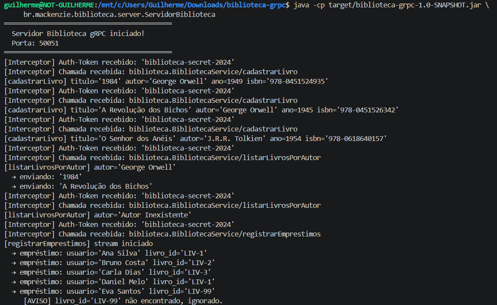
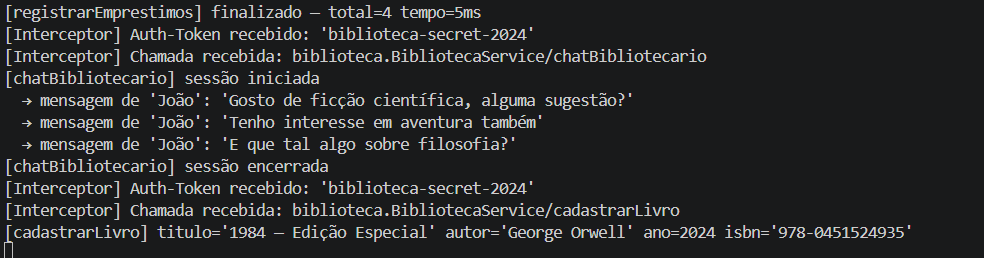
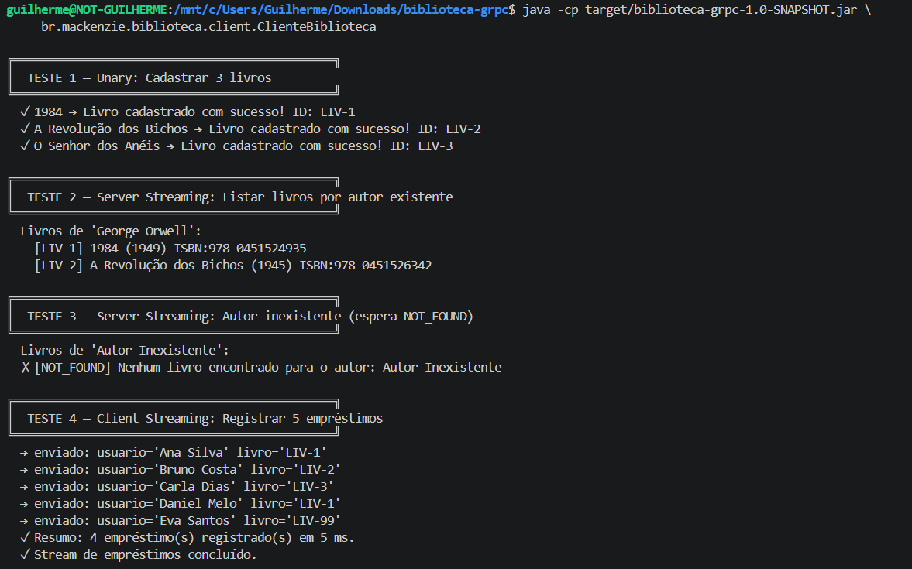

# Biblioteca Digital gRPC

Sistema de Gerenciamento de Biblioteca Digital distribuído, implementado com **Java 17 + Maven + gRPC 1.68**.

---

## Aluno(s)

| Nome Completo | RA |
|---|---|
| _Seu nome aqui_ | _Seu RA aqui_ |

---

## Sobre o projeto

O sistema expõe um único serviço gRPC (`BibliotecaService`) com quatro tipos de RPC:

| # | Tipo | Método | Descrição |
|---|---|---|---|
| 1 | Unary | `cadastrarLivro` | Cadastra um livro; retorna ID gerado e confirmação |
| 2 | Server Streaming | `listarLivrosPorAutor` | Retorna livros de um autor um a um via stream |
| 3 | Client Streaming | `registrarEmprestimos` | Recebe N empréstimos em stream; retorna resumo único |
| 4 | Bidirectional Streaming | `chatBibliotecario` | Para cada mensagem do usuário sugere um livro relacionado |

### Bônus implementados (+15 pts)
- ✅ **Interceptor** de log automático — loga método e parâmetros de toda chamada recebida
- ✅ **Deadline/timeout** — todas as chamadas do cliente possuem prazo configurado (3–10 s)
- ✅ **Autenticação simples via metadata** — token `auth-token` enviado em cada requisição e validado no servidor

---

## Estrutura do projeto

```
biblioteca-grpc/
├── pom.xml
└── src/main/
    ├── java/br/mackenzie/biblioteca/
    │   ├── server/
    │   │   ├── ServidorBiblioteca.java    ← main do servidor + interceptor
    │   │   └── BibliotecaServiceImpl.java ← implementação dos 4 RPCs
    │   └── client/
    │       └── ClienteBiblioteca.java     ← roteiro completo de testes
    └── proto/
        └── biblioteca.proto               ← contrato gRPC (mensagens + serviço)
```

---

## Como compilar e executar

### Pré-requisitos
- Java 17+
- Maven 3.8+

### 1. Compilar

```bash
mvn clean package
```

O Maven baixa automaticamente o `protoc` e o plugin `protoc-gen-grpc-java`, compila o `.proto`, gera os stubs Java e empacota tudo em um único uber-jar.

### 2. Iniciar o servidor (Terminal 1)

```bash
java -cp target/biblioteca-grpc-1.0-SNAPSHOT.jar \
     br.mackenzie.biblioteca.server.ServidorBiblioteca
```

### 3. Executar o cliente (Terminal 2)

```bash
java -cp target/biblioteca-grpc-1.0-SNAPSHOT.jar \
     br.mackenzie.biblioteca.client.ClienteBiblioteca
```

---

## Saída dos testes

### Terminal 1 — Servidor




---

### Terminal 2 — Cliente




## Referências

- [gRPC Java](https://grpc.io/docs/languages/java/)
- [Protocol Buffers 3](https://protobuf.dev/programming-guides/proto3/)
- [Tipos de RPC](https://grpc.io/docs/what-is-grpc/core-concepts/)